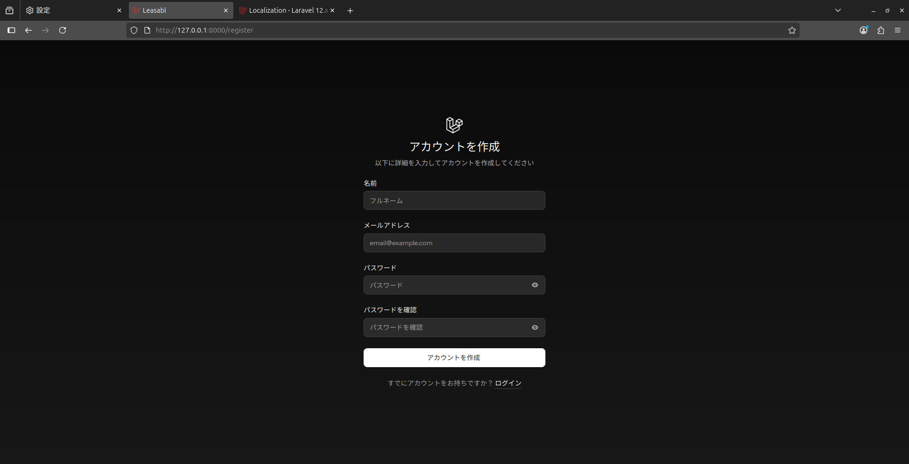

# Laravel-Omnilingual

This is a proof of concept repository to demonstrate the potential of leveraging AI to create a fully-automated language generation pipeline.

## Overview

**Laravel-Omnilingual** is a multilingual-ready Laravel 12 application that automatically extracts localization strings and generates translations using OpenAI's GPT-4o model. It supports real-time detection of new phrases and locale files, ensuring that all supported languages stay up-to-date with no manual effort.

The primary mechanism of action is a middleware pair which sets the locale based on the user's browser settings and extracts translation strings from Blade templates. The middleware then generates the `en.json` file and translates it into any other supported languages using GPT-4o.

## Key Features

- Automatic extraction of `__('...')` strings from Blade/PHP views
- Real-time generation of `en.json` on every request (when running locally)
- Intelligent hash-based diffing to detect meaningful changes
- AI-powered translation using OpenAI (GPT-4o)
- Locale detection from `config('app.supported_locales')`
- Per-locale hash caching to prevent unnecessary API usage
- Automatic generation of translations for newly-added locales

## Setup

### 1. Install dependencies

```shell
composer install  
npm install && npm run build
cp .env.example .env
php artisan key:generate
php artisan migrate
```

### 2. Configure OpenAI

Add your API key to `.env`:

```dotenv
OPENAI_SECRET_KEY=sk-...
```

### 3. Define supported languages

Define the languages you'd like to support in `.env`:

```dotenv
APP_SUPPORTED_LOCALES=en,es
```

## How It Works

The core logic is implemented in a middleware that runs on every request (in `local` environments).

- Scans all Blade templates for `__('...')` usage
- Writes the extracted keys to `resources/lang/en.json`
- Computes a hash of the JSON file’s contents
- For each locale in `supported_locales` (except `'en'`):
    - If the locale file doesn't exist or the hash is outdated:
        - Translates the entire `en.json` using OpenAI GPT-4o
        - Writes `xx.json` (e.g. `fr.json`, `ja.json`)
        - Writes `.xx.hash` to track that it’s synced

## Adding a New Language

1. Add the language code to `supported_locales`:

```dotenv
APP_SUPPORTED_LOCALES=en,es,ja
```

2. Reload any page while in a non-production environment
3. A new file for `resources/lang/ja.json` will be created with AI-translated content

## Translating Register Page (Japanese Example)



## Testing
The easiest way to test the translation functionality is to:
1. Delete the `lang/en.json` file, `en.hash`, and any other locale files
2. Reload any page in a local environment
3. Assure that the `en.json` file is regenerated and translations for all supported locales are created

## License

MIT License

## Acknowledgments

- Laravel 12 + Livewire Starter Kit
- Tailwind CSS
- OpenAI GPT-4o for automatic multilingual translations
